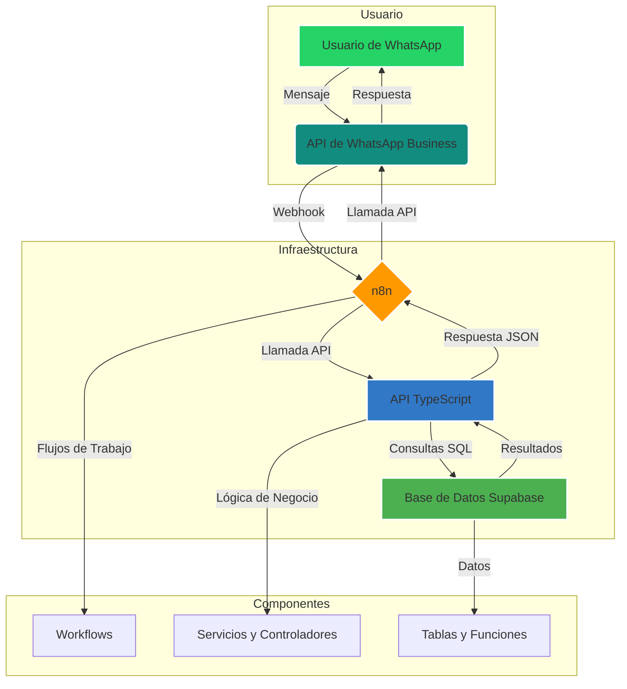

# Arquitectura del Sistema

Esta sección describe la arquitectura del chatbot de lotería, sus componentes principales y cómo interactúan entre sí.

## Diagrama de Arquitectura

## Componentes Principales

### 1. API de WhatsApp Business
- **Proveedor**: Meta (a través de un partner como 360dialog).
- **Función**: Es la puerta de entrada y salida para todos los mensajes. Recibe los mensajes del usuario y envía las respuestas del chatbot.
- **Comunicación**: Se comunica con n8n a través de webhooks.

### 2. n8n (Orquestador)
- **Función**: Actúa como el orquestador central del sistema. No contiene lógica de negocio compleja, sino que dirige el flujo de información.
- **Responsabilidades**:
  - Recibir webhooks de WhatsApp.
  - Extraer el mensaje y el número de teléfono del usuario.
  - Llamar a la API de TypeScript para procesar la lógica.
  - Recibir la respuesta de la API y formatearla para WhatsApp.
  - Enviar la respuesta final al usuario a través de la API de WhatsApp.
- **Workflows**: Los flujos de trabajo están diseñados para ser modulares y reutilizables (enrutador principal, consulta de disponibilidad, etc.).

### 3. API de TypeScript (Cerebro)
- **Función**: Es el "cerebro" del sistema. Contiene toda la lógica de negocio, validaciones y comunicación con la base de datos.
- **Responsabilidades**:
  - Exponer endpoints REST para ser consumidos por n8n.
  - Validar los datos de entrada.
  - Interactuar con la base de datos a través de servicios tipados.
  - Implementar la lógica de negocio (verificar disponibilidad, reservar billetes, buscar en la base de conocimiento).
  - Formatear las respuestas en JSON para n8n.
  - Registrar logs de todas las operaciones.
- **Tecnologías**: Express.js, TypeScript, Zod (para validación), Winston (para logging).

### 4. Base de Datos Supabase (Memoria)
- **Función**: Es la "memoria" del sistema. Almacena todos los datos de manera persistente.
- **Responsabilidades**:
  - Almacenar el inventario de billetes de lotería.
  - Gestionar la lista de abonados.
  - Guardar las órdenes de compra.
  - Mantener el estado de las sesiones de usuario.
  - Almacenar la base de conocimiento para el chitchat.
  - Registrar logs del sistema para auditoría.
- **Características**: Se utilizan funciones de base de datos (RPC) para operaciones complejas y triggers para mantener la integridad de los datos.

## Flujo de Datos (Ejemplo: Consulta de Disponibilidad)

1. **Usuario envía mensaje**: El usuario envía "12345" a WhatsApp.
2. **WhatsApp a n8n**: La API de WhatsApp envía un webhook a n8n con el mensaje y el número del usuario.
3. **n8n a API**: El workflow "Main Router" en n8n recibe el webhook, detecta que es una consulta de número y llama al endpoint `POST /api/tickets/check-availability` de la API de TypeScript, enviando `{"ticketNumber": "12345", "userPhone": "+34..."}`.
4. **API a Supabase**: El `TicketController` en la API valida los datos y llama al `SupabaseService`, que a su vez ejecuta la función `check_ticket_availability` en Supabase.
5. **Supabase procesa**: La función en Supabase verifica si el billete "12345" existe, si está disponible y si el usuario tiene permiso para comprarlo (si es exclusivo).
6. **Supabase a API**: Supabase devuelve el resultado a la API (ej: `{"available": true, "price": 10, ...}`).
7. **API a n8n**: La API formatea la respuesta en JSON y la devuelve a n8n.
8. **n8n a WhatsApp**: n8n recibe el JSON, construye el mensaje de respuesta (ej: "El billete 12345 está disponible por 10€") y lo envía al usuario a través de la API de WhatsApp.
9. **WhatsApp a Usuario**: El usuario recibe la respuesta en su teléfono.

## Ventajas de esta Arquitectura

- **Separación de Responsabilidades**: Cada componente tiene una función clara, lo que facilita el desarrollo, testing y mantenimiento.
- **Escalabilidad**: La API de TypeScript y la base de datos Supabase pueden escalar de forma independiente para manejar un gran volumen de solicitudes.
- **Flexibilidad**: Es fácil cambiar de orquestador (de n8n a otro) o de proveedor de WhatsApp sin afectar la lógica de negocio.
- **Robustez**: La lógica de negocio está centralizada en la API, lo que reduce la complejidad de los workflows de n8n y los hace más fiables.
- **Mantenibilidad**: El código en TypeScript es más fácil de mantener y depurar que la lógica compleja dentro de los nodos de n8n.

## Estructura del Monorepo

El proyecto está organizado en un monorepo para facilitar la gestión de código compartido y dependencias.

- **/api**: Contiene el código de la API de TypeScript.
- **/database**: Migraciones y seeds de la base de datos.
- **/docs**: Documentación del proyecto.
- **/n8n**: Workflows y configuración de n8n.
- **/scripts**: Scripts de utilidades para gestión del sistema.
- **/shared**: Código TypeScript compartido entre los diferentes paquetes (tipos, constantes, etc.).

Esta estructura promueve la reutilización de código y mantiene el proyecto organizado.

